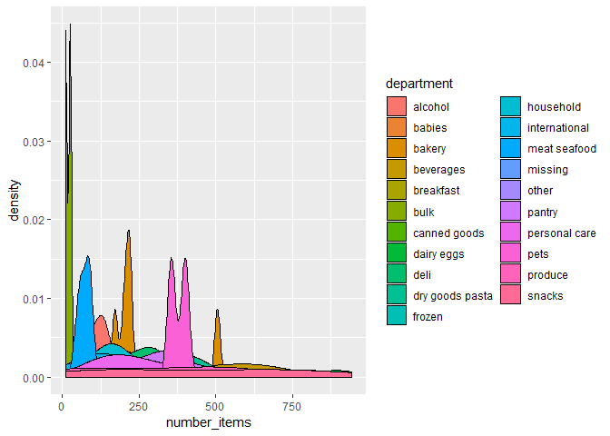

Homework\_3
================
Brennan Baker
October 9, 2018

-   [Problem 1](#problem-1)
-   [Problem 2](#problem-2)
-   [Problem 3](#problem-3)

Problem 1
=========

Load packages

``` r
library(tidyverse)
```

    ## -- Attaching packages ------------------------------------------------------------ tidyverse 1.2.1 --

    ## v ggplot2 3.0.0     v purrr   0.2.5
    ## v tibble  1.4.2     v dplyr   0.7.6
    ## v tidyr   0.8.1     v stringr 1.3.1
    ## v readr   1.1.1     v forcats 0.3.0

    ## -- Conflicts --------------------------------------------------------------- tidyverse_conflicts() --
    ## x dplyr::filter() masks stats::filter()
    ## x dplyr::lag()    masks stats::lag()

``` r
library(p8105.datasets)
```

*Tidy the data*

``` r
brfss = brfss_smart2010 %>% 
  janitor::clean_names() %>% 
  filter(topic == "Overall Health") %>% 
  separate(locationdesc, into = c("state", "county"), sep = "- ") %>% 
  select(year, state, county, response, data_value) %>% 
  mutate(response = tolower(response)) %>% 
  mutate(response = ordered(response, levels = c("excellent", "very good", "good", "fair", "poor")))
```

I cleaned the data by: cleaning the names; keeping only the rows where the topic is overall health; separating "locationdesc" into state and county columns; and excluding unnecessary variables. I converted response to a factor varaible and arranged it with "Excellent"" on top.

*In 2002, which states were observed at 7 locations?*

``` r
brfss %>% 
  filter(year == "2002") %>% 
  distinct(state, county, .keep_all = TRUE) %>% 
  count(state) %>% 
  filter(n == "7") %>% 
  nrow()
```

    ## [1] 3

There were 3 states observed at 7 locations.

*Make a “spaghetti plot” that shows the number of locations in each state from 2002 to 2010*

``` r
brfss %>%
  group_by(year) %>% 
  count(state) %>% 
    ggplot(aes(x = year, y = n, color = state)) +
  geom_line() +
  theme_bw()
```


*Make a table showing, for the years 2002, 2006, and 2010, the mean and standard deviation of the proportion of “Excellent” responses across locations in NY State.*

``` r
brfss %>%
  filter(year %in% c("2002", "2006", "2010"), # filter years, state, and excellent responses
         str_detect(state, "NY"),
         response == "excellent",
         !is.na(data_value)) %>% 
  group_by(year) %>% 
  summarize(mean = mean(data_value), std_dev = sd(data_value)) %>% 
  knitr::kable(digits = 4)
```

|  year|     mean|  std\_dev|
|-----:|--------:|---------:|
|  2002|  24.0400|    4.4864|
|  2006|  22.5333|    4.0008|
|  2010|  22.7000|    3.5672|

*For each year and state, compute the average proportion in each response category (taking the average across locations in a state). Make a five-panel plot that shows, for each response category separately, the distribution of these state-level averages over time.*

``` r
brfss %>%
  group_by(year, state, response) %>%
  filter(!is.na(data_value)) %>% 
  summarize(mean = mean(data_value)) %>% 
  ggplot(aes(x = year, y = mean, color = response)) +
  geom_point() +
  facet_grid(~response) +
  labs(
    title = "Proportion of each response",
    x = "Mean proportion",
    y = "Year"
  ) + 
  theme_bw() +
  viridis::scale_color_viridis(discrete = TRUE) +
  theme(axis.text.x = element_text(angle = 90, hjust = 1))
```


Problem 2
=========

*Load data*

Instacart is an online grocery shopping service.

*How many aisles are there, and which aisles are the most items ordered from?*

``` r
instacart %>% distinct(aisle, .keep_all = TRUE) %>% nrow()
```

    ## [1] 134

There are 134 distinct aisles.

The table below shows the top 5 aisles that contain the most ordered items.

``` r
instacart %>% distinct(aisle, product_name, .keep_all = TRUE) %>%
  count(aisle) %>% 
  arrange(desc(n)) %>% 
  top_n(5) %>% 
  knitr::kable()
```

    ## Selecting by n

| aisle           |    n|
|:----------------|----:|
| candy chocolate |  943|
| yogurt          |  911|
| missing         |  905|
| ice cream ice   |  901|
| chips pretzels  |  844|

*Make a plot that shows the number of items ordered in each aisle. Order aisles sensibly, and organize your plot so others can read it.*

``` r
instacart %>% distinct(aisle, product_name, .keep_all = TRUE) %>%
  group_by(aisle, department) %>% 
  summarise(number_items = n()) %>% 
  ggplot(aes(x =number_items, fill = department)) +
  geom_density()
```

    ## Warning: Groups with fewer than two data points have been dropped.

    ## Warning: Groups with fewer than two data points have been dropped.



*Make a table showing the most popular item aisles “baking ingredients”, “dog food care”, and “packaged vegetables fruits”*

``` r
instacart %>% 
  filter(aisle %in% c("baking ingredients", "dog food care", "packaged vegetables fruits")) %>% 
  group_by(aisle, product_name) %>%
  summarize(number = n()) %>% 
  arrange(desc(number)) %>% 
  top_n(5) %>% 
  knitr::kable()
```

    ## Selecting by number

| aisle                      | product\_name                                   |  number|
|:---------------------------|:------------------------------------------------|-------:|
| packaged vegetables fruits | Organic Baby Spinach                            |    9784|
| packaged vegetables fruits | Organic Raspberries                             |    5546|
| packaged vegetables fruits | Organic Blueberries                             |    4966|
| packaged vegetables fruits | Seedless Red Grapes                             |    4059|
| packaged vegetables fruits | Organic Grape Tomatoes                          |    3823|
| baking ingredients         | Light Brown Sugar                               |     499|
| baking ingredients         | Pure Baking Soda                                |     387|
| baking ingredients         | Cane Sugar                                      |     336|
| baking ingredients         | Premium Pure Cane Granulated Sugar              |     329|
| baking ingredients         | Organic Vanilla Extract                         |     327|
| dog food care              | Snack Sticks Chicken & Rice Recipe Dog Treats   |      30|
| dog food care              | Organix Chicken & Brown Rice Recipe             |      28|
| dog food care              | Small Dog Biscuits                              |      26|
| dog food care              | Standard Size Pet Waste bags                    |      25|
| dog food care              | Organix Grain Free Chicken & Vegetable Dog Food |      24|

*Make a table showing the mean hour of the day at which Pink Lady Apples and Coffee Ice Cream are ordered on each day of the week; format this table for human readers (i.e. produce a 2 x 7 table).*

``` r
instacart %>% 
  filter(product_name %in% c("Pink Lady Apples", "Coffee Ice Cream")) %>%
  group_by(product_name, order_dow) %>% 
  summarize(mean_hour = mean(order_hour_of_day)) %>% 
  spread(key = order_dow, value = mean_hour) %>% 
  knitr::kable()
```

| product\_name    |         0|         1|         2|         3|         4|         5|         6|
|:-----------------|---------:|---------:|---------:|---------:|---------:|---------:|---------:|
| Coffee Ice Cream |  13.77419|  14.31579|  15.38095|  15.31818|  15.21739|  12.26316|  13.83333|
| Pink Lady Apples |  13.44118|  11.36000|  11.70213|  14.25000|  11.55172|  12.78431|  11.93750|

Problem 3
=========
