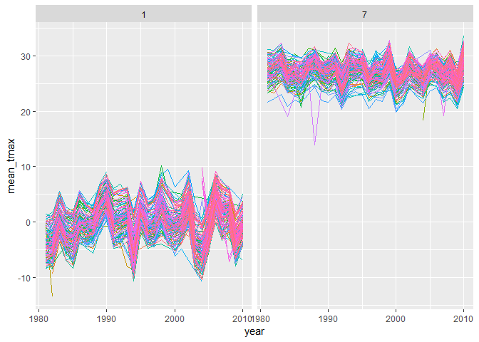

Homework\_3
================
Brennan Baker
October 9, 2018

-   [Problem 1](#problem-1)

Problem 1
=========

Load packages

``` r
library(tidyverse)
```

    ## -- Attaching packages ------------------------------------------------------------ tidyverse 1.2.1 --

    ## v ggplot2 3.0.0     v purrr   0.2.5
    ## v tibble  1.4.2     v dplyr   0.7.6
    ## v tidyr   0.8.1     v stringr 1.3.1
    ## v readr   1.1.1     v forcats 0.3.0

    ## -- Conflicts --------------------------------------------------------------- tidyverse_conflicts() --
    ## x dplyr::filter() masks stats::filter()
    ## x dplyr::lag()    masks stats::lag()

``` r
library(p8105.datasets)
```

*Tidy the data*

``` r
brfss = brfss_smart2010 %>% 
  janitor::clean_names() %>% 
  filter(topic == "Overall Health") %>% 
  separate(locationdesc, into = c("state", "county"), sep = "- ") %>% 
  select(year, state, county, response, data_value) %>% 
  mutate(response = tolower(response)) %>% 
  mutate(response = ordered(response, levels = c("excellent", "very good", "good", "fair", "poor")))
```

I cleaned the data by: cleaning the names; keeping only the rows where the topic is overall health; separating "locationdesc" into state and county columns; and excluding unnecessary variables. I converted response to a factor varaible and arranged it with "Excellent"" on top.

*In 2002, which states were observed at 7 locations?*

``` r
brfss %>% 
  filter(year == "2002") %>% 
  distinct(state, county, .keep_all = TRUE) %>% 
  count(state) %>% 
  filter(n == "7") %>% 
  nrow()
```

    ## [1] 3

There were 3 states observed at 7 locations.

*Make a “spaghetti plot” that shows the number of locations in each state from 2002 to 2010*

``` r
brfss %>%
  group_by(year) %>% 
  count(state) %>% 
    ggplot(aes(x = year, y = n, color = state)) +
  geom_line() +
  theme_bw()
```


*Make a table showing, for the years 2002, 2006, and 2010, the mean and standard deviation of the proportion of “Excellent” responses across locations in NY State.*

``` r
brfss %>%
  filter(year %in% c("2002", "2006", "2010"), # filter years, state, and excellent responses
         str_detect(state, "NY"),
         response == "excellent",
         !is.na(data_value)) %>% 
  group_by(year) %>% 
  summarize(mean = mean(data_value), std_dev = sd(data_value)) %>% 
  knitr::kable(digits = 4)
```

|  year|     mean|  std\_dev|
|-----:|--------:|---------:|
|  2002|  24.0400|    4.4864|
|  2006|  22.5333|    4.0008|
|  2010|  22.7000|    3.5672|

*For each year and state, compute the average proportion in each response category (taking the average across locations in a state). Make a five-panel plot that shows, for each response category separately, the distribution of these state-level averages over time.*

``` r
brfss %>%
  group_by(year, state, response) %>%
  filter(!is.na(data_value)) %>% 
  summarize(mean = mean(data_value)) %>% 
  ggplot(aes(x = year, y = mean, color = response)) +
  geom_point() +
  facet_grid(~response) +
  labs(
    title = "Proportion of each response",
    x = "Mean proportion",
    y = "Year"
  ) + 
  theme_bw() +
  viridis::scale_color_viridis(discrete = TRUE) +
  theme(axis.text.x = element_text(angle = 90, hjust = 1))
```


